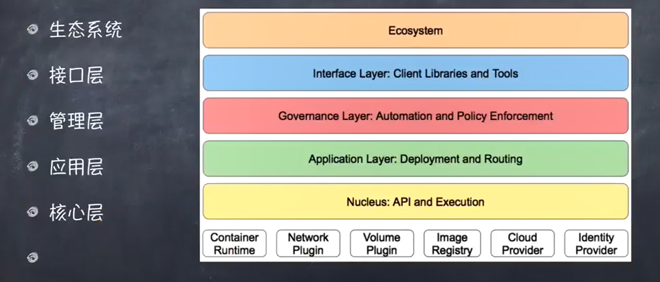
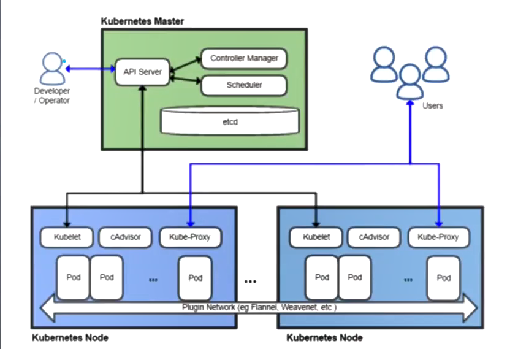

# 大前端之Kubernetes与微服务

## 什么是K8S

- Kubernetes，希腊文导航家，因为首尾字母中间有8个字符，所以被简写成K8s。
- K8s是底层资源（部署那些容器的机器）与容器间的一个抽象层，如果和单机架构类比，可以算是一个分布式时代的Linux
- K8s 是Google开源的容器集群管理系统。在docker技术的基础上，为容器化的应用提供部署运行、资源调度、服务发现（需要什么功能要能找得到）和动态伸缩等一系列完整功能，提高了大规模容器集群管理的便捷性。微服务可以横向纵向扩展，横向就是同样的功能，复制多份拷贝做负载均衡。纵向扩展就是把一个业务串起来，一个业务步骤弄成一个微服务打包到docker里。尽管docker减轻了运维的很多工作，但仍是架不住“多”，容器也需要管理，于是k8s应运而生。

## K8S的特性

- k8s是一个管理容器的工具，也是**管理应用整个生命周期的一个工具，从创建应用，应用的部署，应用提供服务，扩容缩容应用，应用更新**，而且可以做到故障自愈。
- 可移植：支持公有云，私有云，混合云；
- 可扩展：模块化，热插拔（微服务接入和关闭整个系统不用重启），可组合；
- 自愈：自动替换，自动重启，自动复制，自动扩展；

### k8s的管理步骤

- 在k8s进行管理应用的时候，基本步骤是：
  - 创建集群
  - 部署应用
  - 发布应用
  - 扩展应用
  - 更新应用

### K8s的架构结构

## 相关概念

- 主机（Master）：用于控制kubernetes节点的计算机。所有任务分配都来自于此。逻辑结构和物理结构。
  - master 要是出了问题，master的备用启用，1.主从机制，2.选举机制
- 节点（Node）：执行请求和分配任务的计算机。有kubernetes主机负责对节点进行控制。
- 容器集（Pod）：部署在单个节点上的，且包含一个或多个容器的容器组。同一容器集中的所有容器共享一个IP地址、IPC、主机名称及其他资源。容器集会将网络和存储从底层容器中抽象出来。这样您就能更加轻松的在集群中移动容器。
- 复制控制器（Replication controller）：用于控制应在集群某处运行的完全相同的容器集副本数量。
- 服务（Service）：服务可将工作定义（k8s本来要干什么工作做什么活）与容器集分离。kubernetes服务代理会自动将服务请求分配到正确的容器集——无论这个容器集会移到集群中的哪个位置，即使它已被替换。
- Kubelet：这是一个在节点上运行的服务，可读取容器清单，确保指定的容器启动并运行。
  - 对于一个物理机（服务器）来说，可以在里面放一个master也可以再放一个节点
- kubectl：Kubernetes的命令行配置工具。

### 源码编译安装方式

<https://github.com/kubernetes/>  
k8s中文网站：<https://www.kubernetes.org.cn/k8s>

## K8S的安装与配置

- 在Linux下安装单机版的集群环境，又要有master，又要有node。
- 以root身份执行以下操作：
- 1.关闭Linux防火墙,如果你的电脑上启动了SElinux（应用防火墙），那么也要关掉。
  - systemctl stop firewalld
  - systemctl disable firewalld
- 2.安装kubernetes和依赖组件etcd（类似于Windows的注册表）
  - yum install -y etcd kubernetes
- 3.修改配置
  - Docker配置文件 `/etc/sysconfig/docker`，`OPTIONS='--selinux-enabled=false --insecure-registry gcr.io'`
  - Kubernetes apiserver`/etc/kubernetes/apiserver`, 把`--admission-control`参数中的ServiceAccount删除
- 4.按顺序启动所有的服务
  - systemctl start etcd
  - systemctl start docker
  - systemctl start kube-apiserver
  - systemctl start kube-controller-manager
  - systemctl start kube-scheduler
  - systemctl start kubelet
  - systemctl start kube-proxy

### k8s 相关资源

- 官网 <https://kubernetes.io>
- Chart 应用仓库 <https://hub.kubeapps.com>
- 中文手册 <https://www.kubernetes.org.cn/docs>
